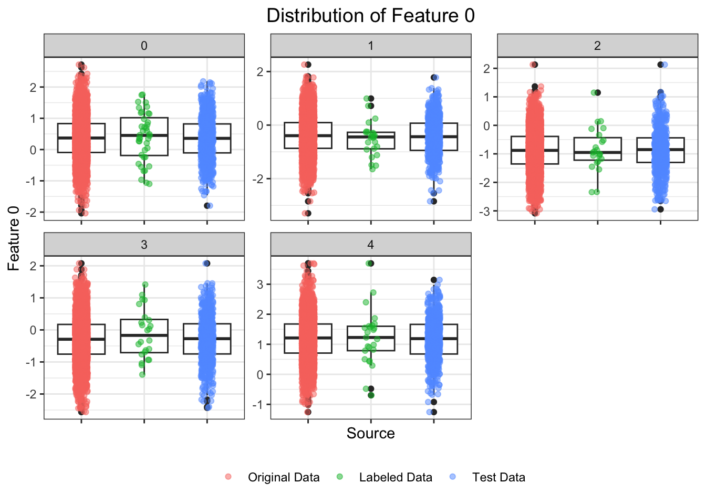
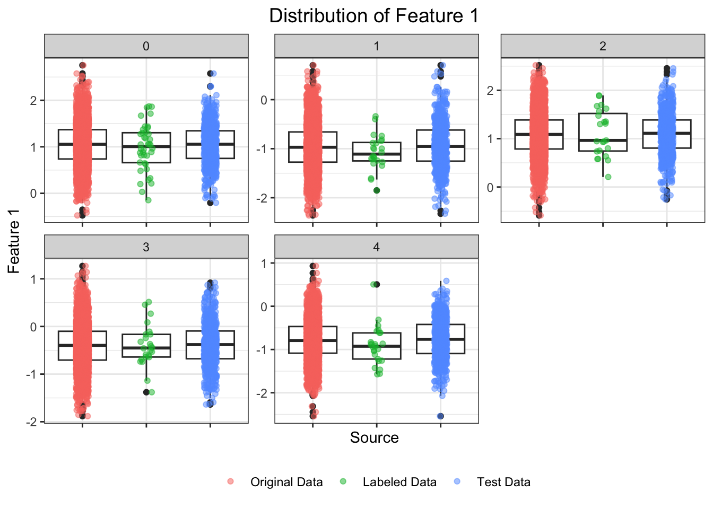
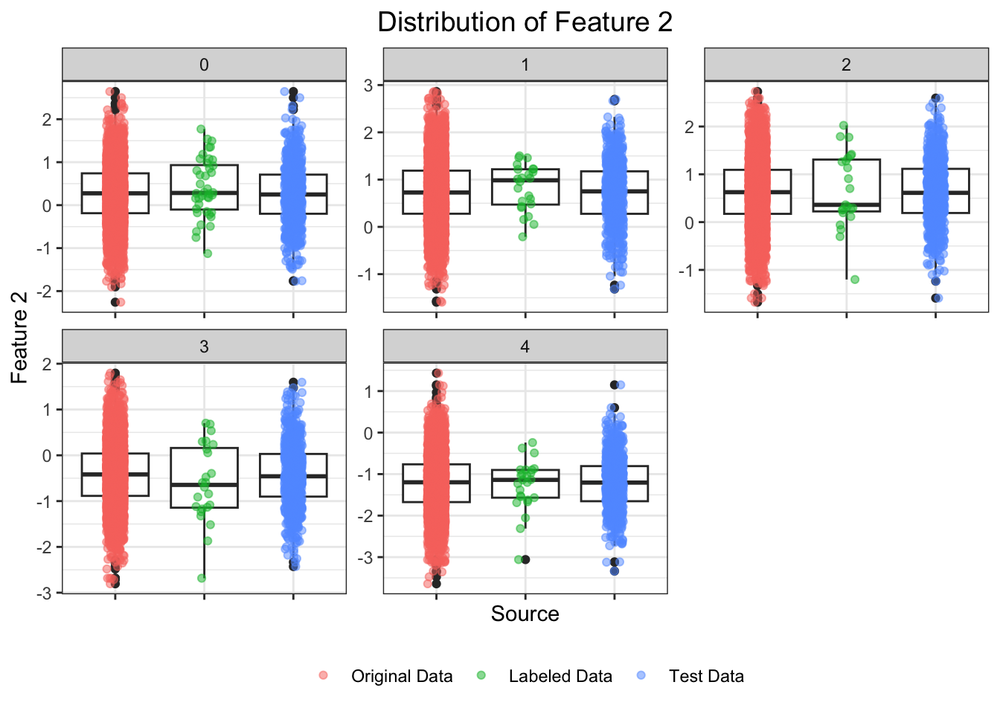
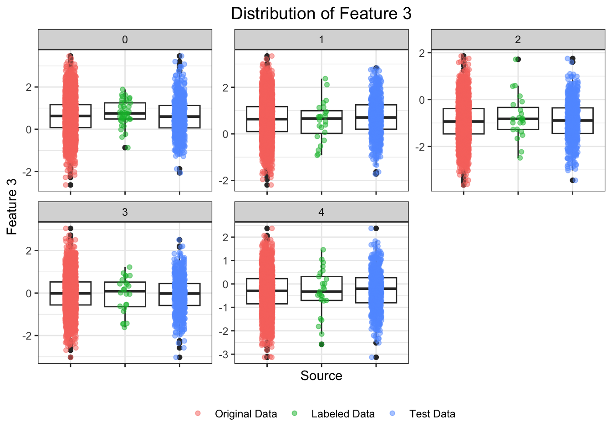
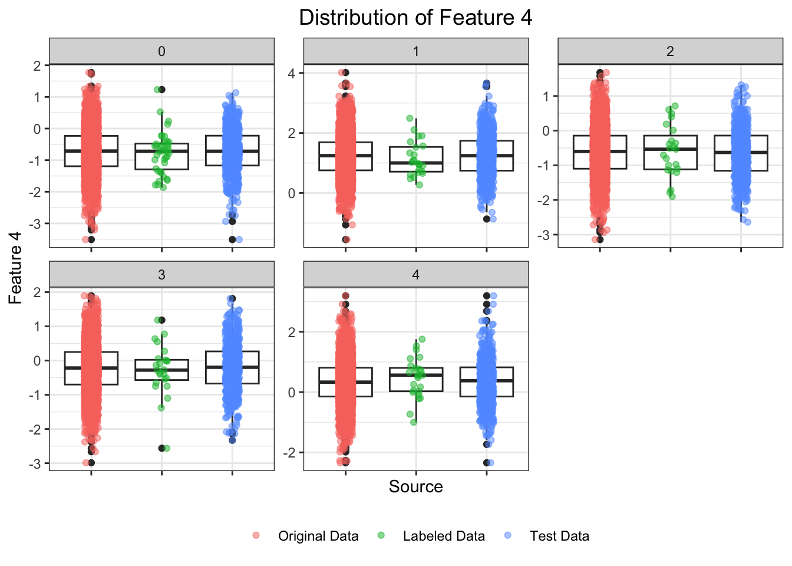
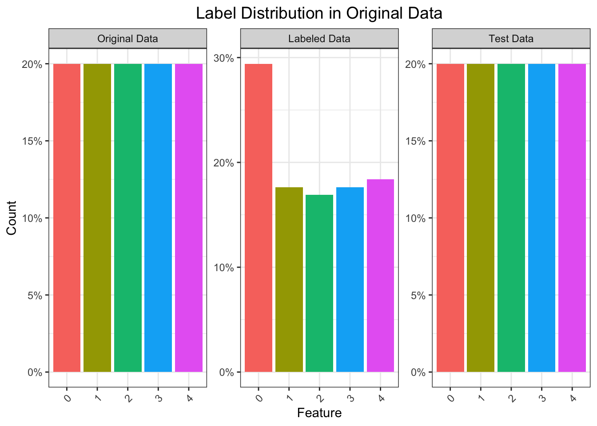
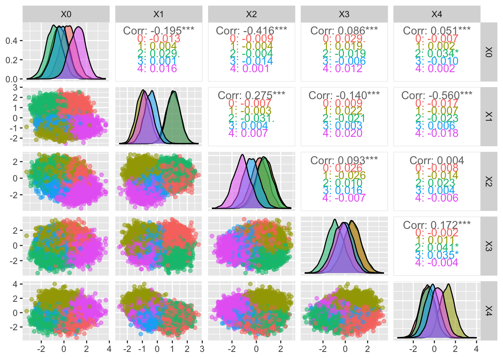
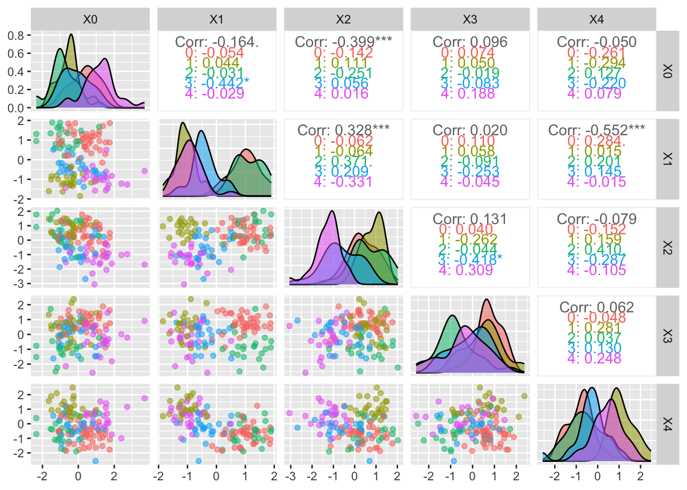
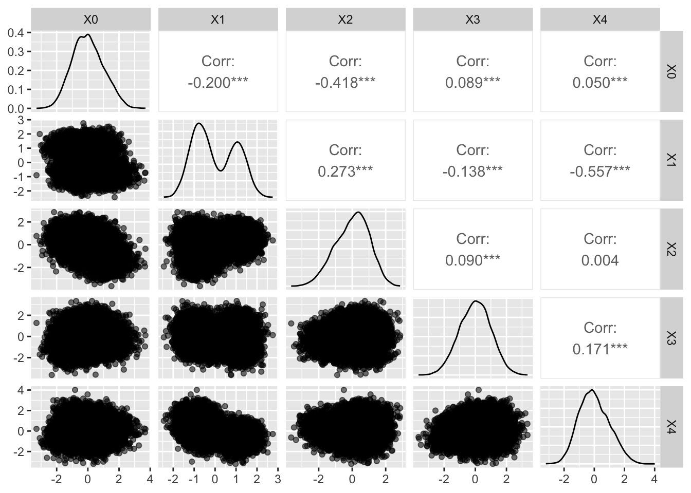
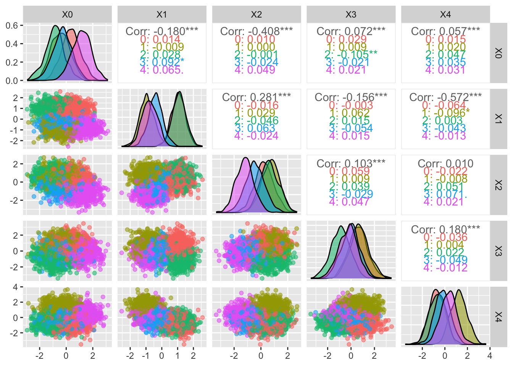

# Import data

Four dataframes are imported:

- `data_ori`: It contains the original data with labels.
- `data_ss`: It contains the semi-supervised data, which includes both labeled and unlabeled data.
- `data_label`: It contains the labeled data of the unlabeled data.
- `data_test`: It contains the test data.


# Simulation explanation
The data was simulated using the function `make_blobs` from the `sklearn.datasets` library in Python. The function generates Gaussian blobs for clustering. The data was generated with the following parameters:

- Number of samples: 17000
- Number of classes: 5 because there five types of myositis
- Number of features: 5
- Number of test samples: 3400 (20% of the total samples)
- Number of semi-supervised samples: 13600 (80% of the total samples)
- Label rate for semi-supervised learning: 0.01 (1% of the data is labeled)
- Number of labeled samples: 136 (1% of the semi-supervised data)
- Standard deviation of the clusters: 2
- Number of centers (classes) for the blobs: 5

# Data exploration


<table class="table table-striped" style="color: black; width: auto !important; margin-left: auto; margin-right: auto;">
<caption>(\#tab:unnamed-chunk-2)Dimensions of the data frames</caption>
 <thead>
  <tr>
   <th style="text-align:left;font-weight: bold;background-color: rgba(217, 237, 247, 255) !important;"> Data </th>
   <th style="text-align:right;font-weight: bold;background-color: rgba(217, 237, 247, 255) !important;"> Rows </th>
   <th style="text-align:right;font-weight: bold;background-color: rgba(217, 237, 247, 255) !important;"> Columns </th>
   <th style="text-align:right;font-weight: bold;background-color: rgba(217, 237, 247, 255) !important;"> labeled </th>
   <th style="text-align:right;font-weight: bold;background-color: rgba(217, 237, 247, 255) !important;"> unlabeled </th>
  </tr>
 </thead>
<tbody>
  <tr>
   <td style="text-align:left;font-weight: bold;background-color: rgba(245, 245, 245, 255) !important;"> Original Data </td>
   <td style="text-align:right;width: 3cm; background-color: rgba(245, 245, 245, 255) !important;"> 17000 </td>
   <td style="text-align:right;width: 3cm; background-color: rgba(245, 245, 245, 255) !important;"> 5 </td>
   <td style="text-align:right;width: 3cm; background-color: rgba(245, 245, 245, 255) !important;"> 17000 </td>
   <td style="text-align:right;width: 3cm; background-color: rgba(245, 245, 245, 255) !important;"> 0 </td>
  </tr>
  <tr>
   <td style="text-align:left;font-weight: bold;background-color: rgba(245, 245, 245, 255) !important;"> Semi Supervised Data </td>
   <td style="text-align:right;width: 3cm; background-color: rgba(245, 245, 245, 255) !important;"> 13600 </td>
   <td style="text-align:right;width: 3cm; background-color: rgba(245, 245, 245, 255) !important;"> 5 </td>
   <td style="text-align:right;width: 3cm; background-color: rgba(245, 245, 245, 255) !important;"> 136 </td>
   <td style="text-align:right;width: 3cm; background-color: rgba(245, 245, 245, 255) !important;"> 13464 </td>
  </tr>
  <tr>
   <td style="text-align:left;font-weight: bold;background-color: rgba(245, 245, 245, 255) !important;"> Labeled Data </td>
   <td style="text-align:right;width: 3cm; background-color: rgba(245, 245, 245, 255) !important;"> 13464 </td>
   <td style="text-align:right;width: 3cm; background-color: rgba(245, 245, 245, 255) !important;"> 5 </td>
   <td style="text-align:right;width: 3cm; background-color: rgba(245, 245, 245, 255) !important;"> 13464 </td>
   <td style="text-align:right;width: 3cm; background-color: rgba(245, 245, 245, 255) !important;"> 0 </td>
  </tr>
  <tr>
   <td style="text-align:left;font-weight: bold;background-color: rgba(245, 245, 245, 255) !important;"> Test Data </td>
   <td style="text-align:right;width: 3cm; background-color: rgba(245, 245, 245, 255) !important;"> 3400 </td>
   <td style="text-align:right;width: 3cm; background-color: rgba(245, 245, 245, 255) !important;"> 5 </td>
   <td style="text-align:right;width: 3cm; background-color: rgba(245, 245, 245, 255) !important;"> 3400 </td>
   <td style="text-align:right;width: 3cm; background-color: rgba(245, 245, 245, 255) !important;"> 0 </td>
  </tr>
</tbody>
</table>

## Descritive Statistics

 


The boxplots below show the distribution of the features in the original data, semi-supervised data, labeled data, and test data. The boxplots will help us to visualize the distribution of the features and to identify any outliers in the data.


### Each Variable {.tabset}

#### Feature 0 


``` r
df %>% 
  filter(source != "Unlabeled Data") %>%
  ggplot(aes(x = source, y = X0)) +
  geom_boxplot() +
  geom_jitter(aes(color = source), alpha = 0.5, width = 0.1) +
  labs(title = "Distribution of Feature 0", x = "Source", y = "Feature 0") +
  theme_bw() +
  facet_wrap(~target, scales = "free") +
  theme(legend.position = "bottom",
        plot.title = element_text(size = 14,hjust = 0.5),
        legend.title = element_blank(),
        axis.text.x =  element_blank())
```



#### Feature 1

``` r
df %>% 
  filter(source != "Unlabeled Data") %>%
  ggplot(aes(x = source, y = X1)) +
  geom_boxplot() +
  geom_jitter(aes(color = source), alpha = 0.5, width = 0.1) +
  labs(title = "Distribution of Feature 1", x = "Source", y = "Feature 1") +
  theme_bw() +
  facet_wrap(~target, scales = "free") +
  theme(legend.position = "bottom",
        plot.title = element_text(size = 14,hjust = 0.5),
        legend.title = element_blank(),
        axis.text.x =  element_blank())
```



#### Feature 2

``` r
df %>% 
  filter(source != "Unlabeled Data") %>%
  ggplot(aes(x = source, y = X2)) +
  geom_boxplot() +
  geom_jitter(aes(color = source), alpha = 0.5, width = 0.1) +
  labs(title = "Distribution of Feature 2", x = "Source", y = "Feature 2") +
  theme_bw() +
  facet_wrap(~target, scales = "free") +
  theme(legend.position = "bottom",
        plot.title = element_text(size = 14,hjust = 0.5),
        legend.title = element_blank(),
        axis.text.x =  element_blank())
```



#### Feature 3


``` r
df %>% 
  filter(source != "Unlabeled Data") %>%
  ggplot(aes(x = source, y = X3)) +
  geom_boxplot() +
  geom_jitter(aes(color = source), alpha = 0.5, width = 0.1) +
  labs(title = "Distribution of Feature 3", x = "Source", y = "Feature 3") +
  theme_bw() +
  facet_wrap(~target, scales = "free") +
  theme(legend.position = "bottom",
        plot.title = element_text(size = 14,hjust = 0.5),
        legend.title = element_blank(),
        axis.text.x =  element_blank())
```



#### Feature 4

``` r
df %>% 
  filter(source != "Unlabeled Data") %>%
  ggplot(aes(x = source, y = X4)) +
  geom_boxplot() +
  geom_jitter(aes(color = source), alpha = 0.5, width = 0.1) +
  labs(title = "Distribution of Feature 4", x = "Source", y = "Feature 4") +
  theme_bw() +
  facet_wrap(~target, scales = "free") +
  theme(legend.position = "bottom",
        plot.title = element_text(size = 14,hjust = 0.5),
        legend.title = element_blank(),
        axis.text.x =  element_blank())
```



## Label distribution
The label distribution shows the number of samples for each class in the original data, semi-supervised data, and test data. The distribution will help us to understand the balance of the classes in the data.


## Pairs plots {.tabset}

In this section, we will visualize the data using pairs plots. The pairs plots will show the relationships between the features in the data. The original data will be compared with the semi-supervised data, which includes both labeled and unlabeled data. 

### Original data


### Semi-supervised data Labeled

``` r
# Semi Supervised data
#my_colors <- c("blue", "green", "purple", "orange","brown")

# Labeled data
data_ss %>% 
      filter(target != '-1') %>% 
        ggpairs(columns = 1:5,
                aes(color = target, alpha = 0.5)) 
```



``` r
  #scale_fill_manual(values = my_colors) +
  #scale_color_manual(values = my_colors)
```


### Semi-supervised data Unlabeled

``` r
# Unlabeled data
data_ss %>% 
      filter(target == '-1') %>% 
        ggpairs(columns = 1:5, aes(alpha = 0.5)) +
  scale_fill_manual(values = 'black') +
  scale_color_manual(values = 'black')
```



### Test data

``` r
# Test data
data_test %>% 
        ggpairs(columns = 1:5,
                aes(color = target,  
                alpha = 0.5))
```




